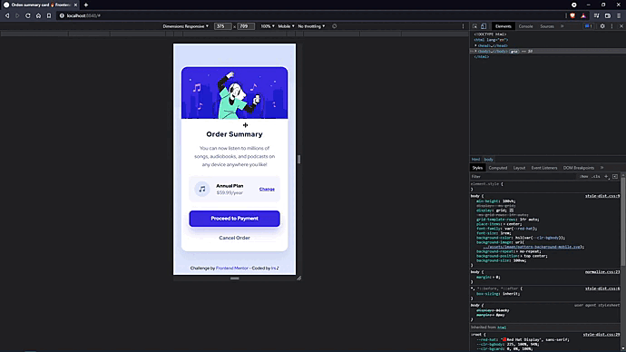
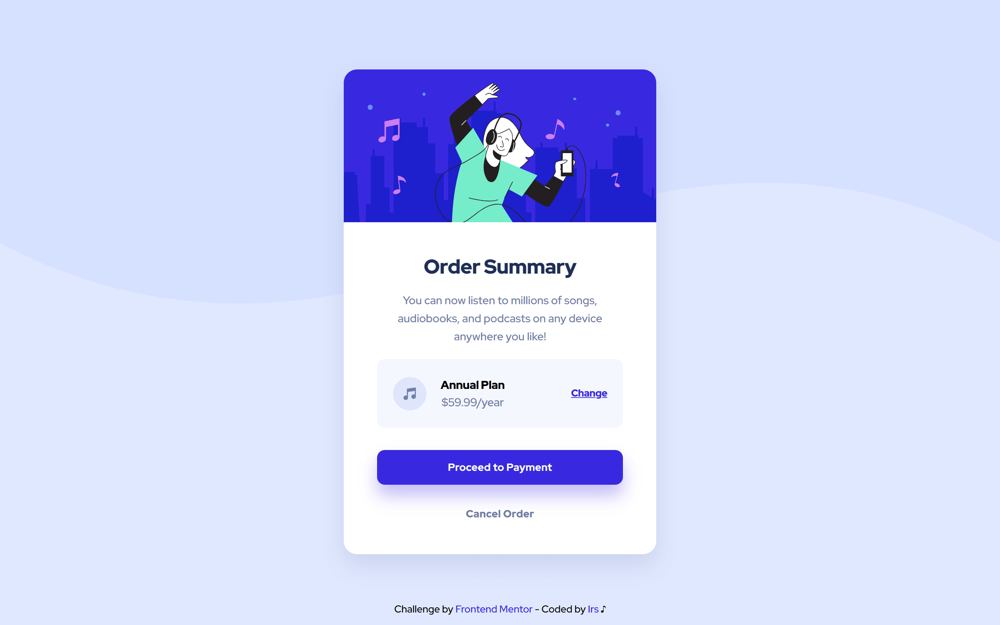

# Frontend Mentor - Order summary card solution

Hi 👋 
This is a solution to the [Order summary card challenge on Frontend Mentor](https://www.frontendmentor.io/challenges/order-summary-component-QlPmajDUj). 
If you liked my solution, give me a 🌟.  
Thank you 😉

## Table of contents

  - [The challenge](#the-challenge)
  - [Screenshot](#screenshot)
  - [Links](#links)
  - [Built with](#built-with)
  - [Author](#author)

## The challenge

Users should be able to:

- See hover states for interactive elements

## Screenshot

- Mobile

- Desktop

## Links

- [Live](https://irs-mp.github.io/order-summary/) 👀

## Built with

- Mobile-first workflow
- Semantic HTML5 markup
- CSS custom properties
- CSS Grid

## Author

- Frontend Mentor - [@Irs-mp](https://www.frontendmentor.io/profile/Irs-mp)
- Twitter - [@Irs_mp](https://twitter.com/Irs_mp)
